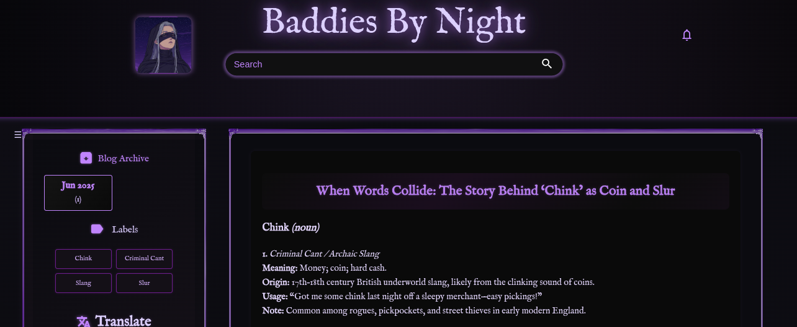

# 🩸 Baddies By Night – Blogger Theme

A dark, custom Blogger theme built for the **Baddies By Night** project.

> **Defense Against the Dark Arts for the Modern Mind**  
> We explore the uncomfortable, the unseemly, the questionable, and the unsettling—not to glorify the dark, but to illuminate the path of innovation. By engaging the taboo, we aim to accelerate the velocity of ideas and thought.

---

## 🌐 Live Preview

👉 [View the Theme on BaddiesByNight.blogspot.com](https://baddiesbynight.blogspot.com)

---

## 🖼️ Screenshot

---

## 📁 Features

- High-contrast dark color palette
- Clean, modern typography
- Custom link and hover effects
- Mobile-friendly and responsive design
- Built for writing that dares to go deep and dark

---

## 🎨 Theme Colors

| Element         | Hex Code    |
|----------------|-------------|
| Text Main      | `#aefeff`   |
| Background     | `#050505`   |
| Border         | `#00fff7`   |
| Link           | `#8effff`   |
| Link Hover     | `#ffffff`   |

---

## ⚖️ License

Open source and free to use. Attribution appreciated but not required.

---

## ✨ Credits

Created with darkness, curiosity, and code by the **Baddies By Night** collective.
